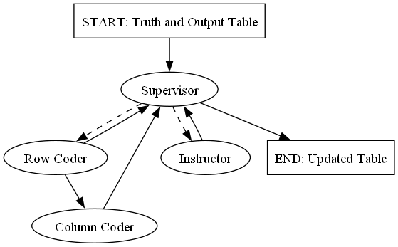
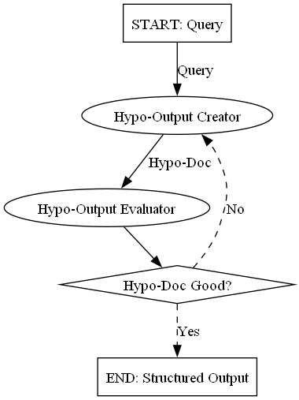

## Description

This workbook uses an agentic workflow to process PDF and evaluate results through the LangGraph framework.

## Getting Started

Notes on getting set-up

I used CUDA 11. Can install from NVIDIA website.

### Installations

Install the correct version of pytorch, LangChain, transformers. Make sure to have right version of CUDA with pytorch.

Following needs to be added to PATH:
1. CUDA

```
conda install langchain
conda install langgraph
```

## Formatter (Working)

Code in accuracy_genai folder.




### Data Creation

In datacreation.ipynb, we make a table with 20 columns and 3 rows. We then Scramble the rows and columns and change the nomenclature as another table. They are outputted into truth.csv and scrambled.csv.

### Formatter

The python notebook formatter.ipynb sets up the the agents, makes a graph, then sets up the two tables for the formatter to use.

### Accuracy Calculator

A basic accuracy metric is the percentage of cells in scrambled that are within 1% of its corresponding cell in truth. 
For example, P2 Units Sold cell should correspond to the Product 2 Quantity Cell.

## Pdf to Text (Not Finished)

